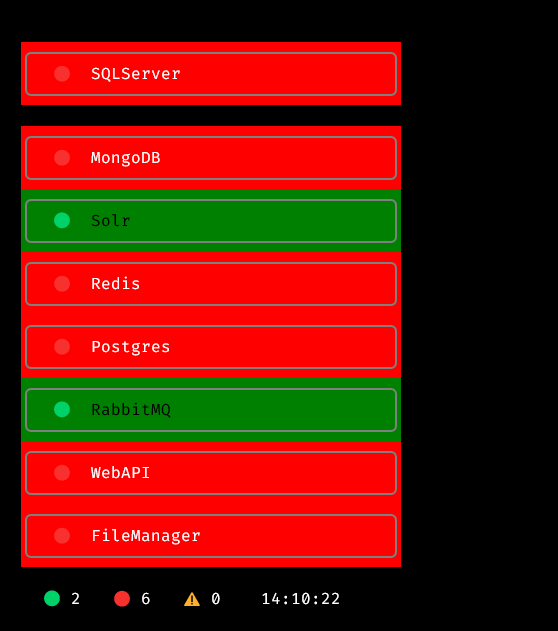

# status-dash

This is what it looks like when you run the `status-dash` command:
- First, create and activate a virtual environment:
- pip install -r requirements.txt
- Then, run the script:

```bash
$ python status-dash.py
```



